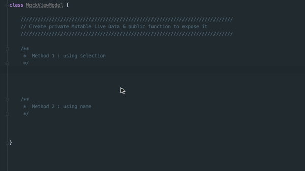

# android-studio-live-template 
Android Studio Live Templates Collection

### AndroidLiveData.xml
- **`TC`**: "Surround with try catch"
- **`live_sel`**: "Create private LiveData &amp; public function to expose it"
- **`live`**: "Create private LiveData &amp; public function to expose it"
- **`livez_sel`**: "Create private lazy LiveData &amp; public function to expose it"
- **`livez`**: "Create private lazy LiveData &amp; public function to expose it"